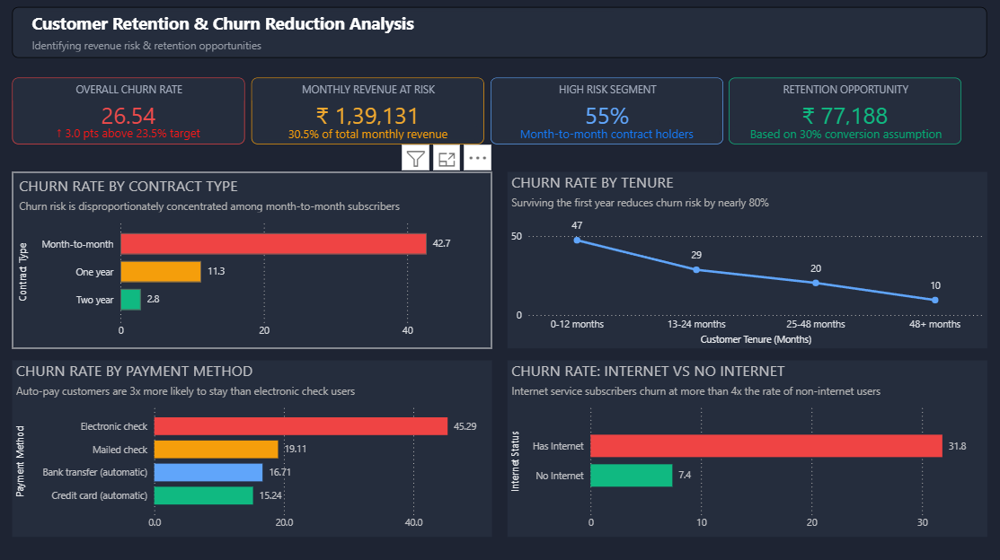
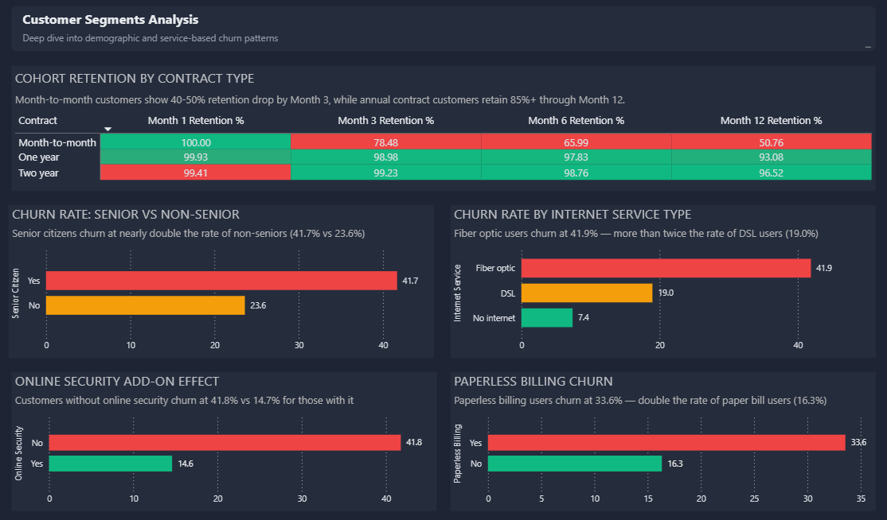
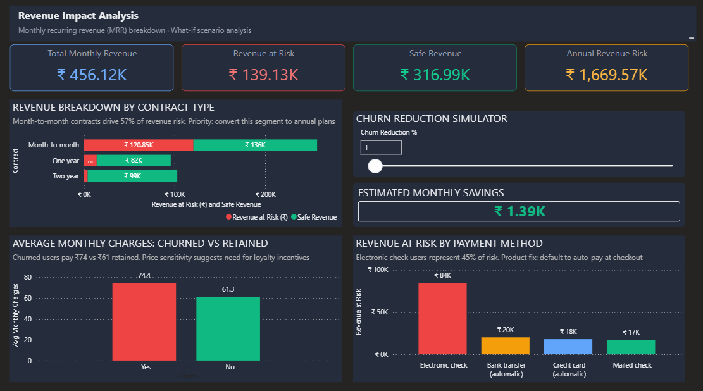
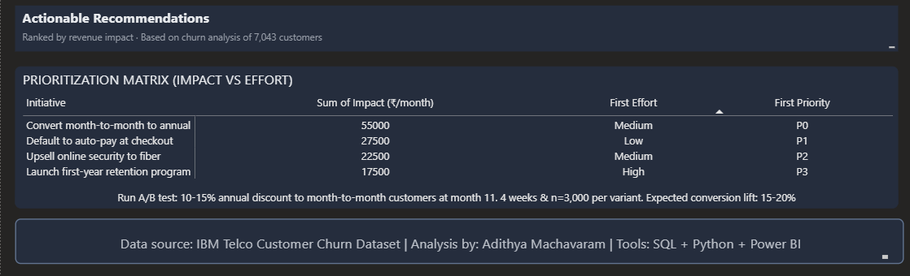

# Customer Retention & Churn Reduction Analysis

**Author:** Adithya Machavaram  
**Tools:** SQL · Python · Power BI  
**Dataset:** IBM Telco Customer Churn · 7,043 records

---

## What This Project Is About

Telecom companies lose customers every month. Some leave within weeks. Others stay for years. This project answers two simple questions: who leaves, and what can we do about it?

I analyzed 7,043 customer records to understand churn patterns. The data includes contract types, payment methods, monthly charges, and service usage. Based on the findings, I built a Power BI dashboard and wrote recommendations that can be tested through experiments.

This is not just a churn dashboard. It is a retention study that connects data to business action.

---

## What I Found

**Contract type is the strongest predictor of churn.**

Customers on month-to-month plans leave at 42.7 percent. That is fifteen times higher than customers on two-year contracts, who leave at just 2.8 percent. Fifty-five percent of all customers are on month-to-month plans. This is a large group with high risk.

**Payment method matters almost as much.**

Customers who pay by electronic check churn at 45.3 percent. Customers on auto-pay — bank transfer or credit card — churn at around 15 to 16 percent. The gap between these two groups is nearly thirty percentage points.

**The first year is critical.**

Forty-seven percent of all churn happens in the first twelve months. Customers who stay beyond one year become much more loyal. After four years, the churn rate drops to just 9.5 percent.

**Other patterns worth noting.**

Senior citizens churn at 41.7 percent — nearly double the rate of non-seniors. Fiber optic internet users churn at 41.9 percent, more than twice the rate of DSL users. Customers without online security churn at 41.8 percent, compared to 14.7 percent for those who have it. Paperless billing users churn at 33.6 percent compared to 16.3 percent for paper bill users.

**Revenue at risk.**

Total monthly revenue across all customers is 4.56 lakh rupees. Customers who have already churned represent 1.39 lakh rupees in monthly revenue at risk — about 30.5 percent of total monthly revenue. Annualized, this comes to roughly 16.7 lakh rupees at risk.

Under conservative assumptions, reducing churn by 10 percent could save between 1.2 and 1.5 lakh rupees annually.

---

## Cohort Retention Analysis

A cohort is a group of customers who signed up in the same month. Tracking how these groups behave over time tells us whether retention is improving.

Here is what the cohort analysis revealed.

For month-to-month customers, retention drops sharply in the first three months. Month 1 retention starts at 100 percent. By Month 3, it falls to 78 percent. By Month 6, it is down to 66 percent. By Month 12, only 51 percent remain. The biggest drop happens between Month 1 and Month 3.

For one-year contract customers, retention stays high. Month 3 retention is 99 percent. Month 6 retention is 98 percent. Month 12 retention is 93 percent.

For two-year contract customers, retention is even stronger. Month 3 retention is 99 percent. Month 6 retention is 99 percent. Month 12 retention is 97 percent.

The key takeaway: the first ninety days are critical. If a month-to-month customer survives past three months, their retention improves significantly.

---

## Recommendations Turned into Experiments

A good analysis leads to action. But action without testing is just guessing. I turned each recommendation into an experiment that can be A/B tested.

**Experiment 1: Annual upgrade nudge**

The problem: month-to-month customers churn at 42.7 percent, fifteen times higher than two-year contract holders.

The intervention: show an in-app notification at month eleven offering a 10 to 15 percent discount on an annual plan.

The experiment would involve three variants. Control sees standard pricing. Treatment A sees a 10 percent annual discount. Treatment B sees a 15 percent annual discount plus free online security. Each group would need about 3,000 customers to reach statistical significance.

Success metrics include the annual contract upgrade rate as the primary measure. Secondary measures include six-month retention. Guardrail metrics include refund requests, which should not increase by more than 2 percent.

**Experiment 2: Auto-pay incentive**

The problem: electronic check users churn at 45.3 percent compared to 15.2 percent for auto-pay users.

The intervention: offer a 50 rupee monthly credit for the first six months after switching to auto-pay.

This experiment would use a switchback design — alternating the offer monthly to avoid customer contamination. The primary success metric is auto-pay conversion rate. The secondary metric is thirty-day delinquency reduction.

**Experiment 3: First-year retention program**

The problem: 47.4 percent of all churn happens in the first twelve months.

The intervention: an automated engagement sequence at months three, six, and nine, plus a loyalty credit at month six.

This would use a pre-post analysis with a matched control group. The primary success metric is twelve-month retention rate.

---

## Prioritization Matrix

Not all recommendations are equal. Some deliver high impact with low effort. Others take more work for less return.

| Initiative | Impact (₹/month) | Effort | Priority |
|------------|------------------|--------|----------|
| Convert month-to-month to annual | 55,000 | Medium | P0 |
| Default to auto-pay at checkout | 27,500 | Low | P1 |
| Upsell online security to fiber | 22,500 | Medium | P2 |
| Launch first-year retention program | 17,500 | High | P3 |

Start with P0. Run an A/B test for the annual upgrade nudge. Offer a 10 to 15 percent discount to month-to-month customers at month 11. Run it for 4 weeks with 3,000 customers per variant. Expected conversion lift is 15 to 20 percent.

P0 and P1 together recover roughly 70 percent of at-risk revenue.

---

## Dashboard Preview

Below are screenshots of the four-page Power BI dashboard built for this analysis.

**Page 1: Executive Summary**
Shows the headline numbers — churn rate, revenue at risk, high-risk segment percentage, retention opportunity — plus key charts for contract type and tenure.

**Page 2: Customer Segments**
Breaks down churn by demographics and service categories including senior status, internet service type, online security, and paperless billing. The cohort retention matrix shows how retention differs by contract type over time.

**Page 3: Revenue Impact**
Shows revenue breakdown by contract type, a what-if churn reduction simulator, average monthly charges comparison, and revenue at risk by payment method.

**Page 4: Recommendations**
Summarizes the prioritization matrix with impact and effort estimates. Includes an A/B test plan for the highest-priority initiative.

---

## How This Project Was Built

**Data extraction.** SQL was used to segment customers by contract type, tenure, payment method, and service usage. Five analytical queries answered specific business questions about churn patterns.

**Data cleaning.** Python with the Pandas library handled missing values in the TotalCharges column, where eleven records contained whitespace instead of nulls.

**Analysis.** A logistic regression model built with scikit-learn identified the strongest predictors of churn. Contract type, monthly charges, and tenure emerged as the top three drivers.

**Visualization.** All insights were compiled into a four-page Power BI dashboard with a consistent dark theme. The dashboard includes KPI cards, bar charts, line charts, a cohort retention matrix, a what-if parameter for churn simulation, and a prioritization matrix.

**Deployment.** The complete project — code, SQL queries, dashboard file, screenshots, and this case study — is hosted on GitHub.

---

## Repository Structure

The project files are organized as follows.

- data/raw/ contains the original CSV dataset.
- data/processed/ contains the cleaned dataset after handling missing values.
- notebooks/ contains the Jupyter notebooks for data cleaning, exploratory analysis, SQL queries, and churn prediction modeling.
- queries/ contains the SQL query files as standalone .sql documents.
- dashboard/ contains the Power BI .pbix file and a PDF export.
- screenshots/ contains PNG images of all four dashboard pages.
